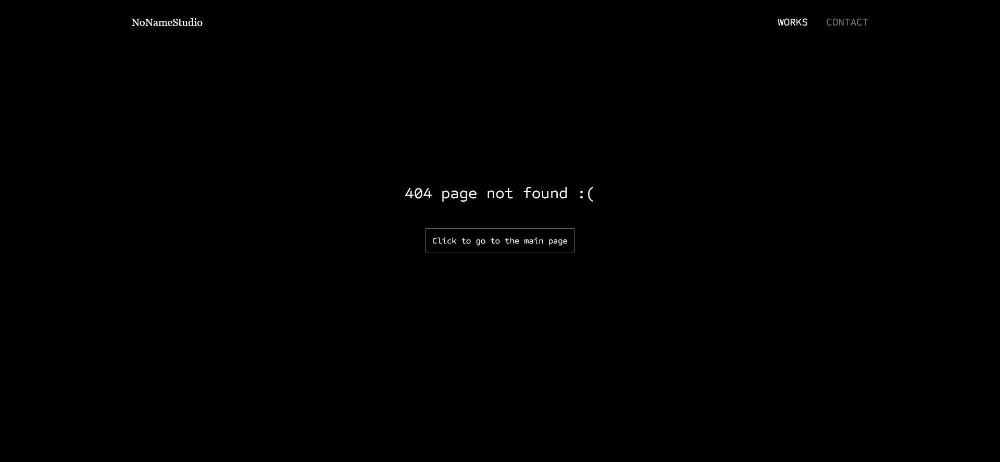

# icodethis - Error page

This is a solution to a challenge "404 Error Page" from the website [ICodeThis](https://icodethis.com/modes/design-to-code/42/submissions).

## Table of contents
- [icodethis - Error page](#icodethis---error-page)
  - [Table of contents](#table-of-contents)
  - [Task](#task)
  - [Screenshot](#screenshot)
  - [Links](#links)
  - [Built with](#built-with)
  - [Author](#author)

## Task

Start with this design and transform it into a functional project using HTML, CSS, and JavaScript.
If you want to go the extra mile, expand upon it, and integrate your unique touch by adding animations and interactivity.
Prioritize creativity over pixel-perfect accuracy and showcase your developer ingenuity.
P.S. My page was inspired by Neutral Studio’s 404 error page (https://neutral-studio.com/404).

## Screenshot

## Links

[Background Changer Page](https://your-solution-url.com)

## Built with

- Semantic HTML5
- Modern CSS3
- Vanilla JavaScript
- Fully responsive design

## Author

- Website - [Andrei Martinenko](https://www.frontender.biz)
- Github - [@AxinitM](https://github.com/AxinitM)
- ICodeThis - [Axinit](https://icodethis.com/Axinit)
